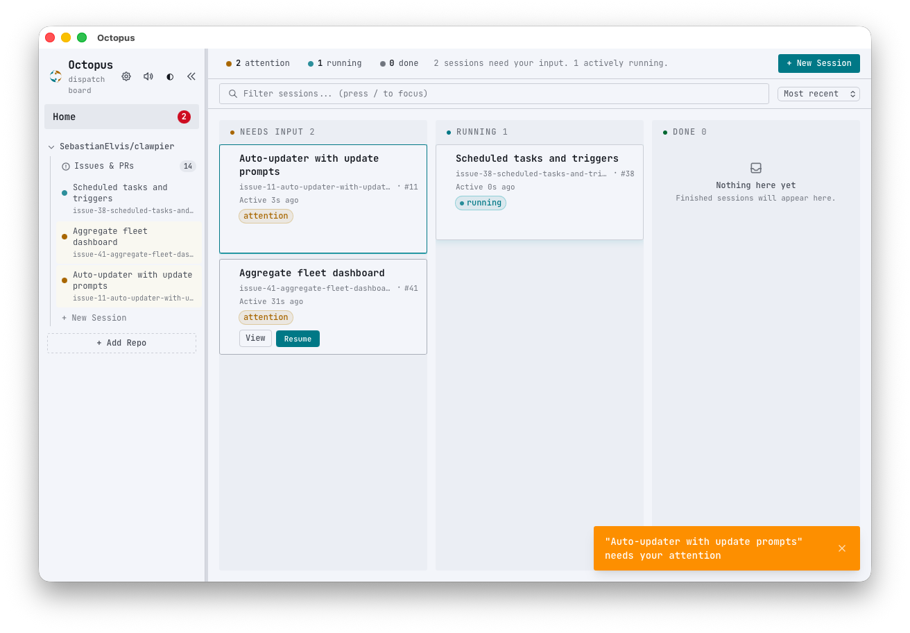
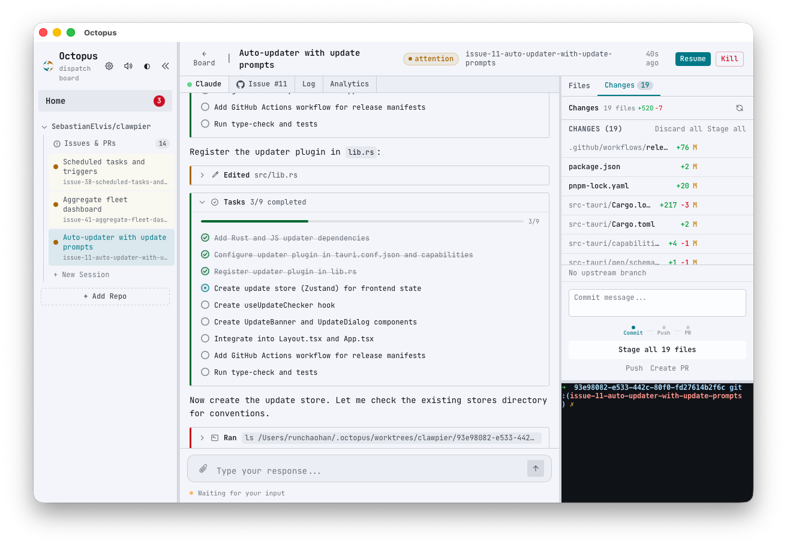

# Octopus

**The Claude Code frontend for ADHD developers.**

You launched 15 Claude Code sessions. Three need permission. One is waiting for a decision. Two finished and need PRs. You forgot about the one that's been stuck for 20 minutes. You opened Twitter "for a second" and now it's been 40 minutes.

Octopus is your external working memory. It keeps track so your brain doesn't have to.

<p align="center">
  
  
</p>

## The problem

Claude Code is powerful. You can run dozens of sessions in parallel, each one writing real code. But the bottleneck was never Claude — it's **you**. Reading terminal output. Switching tabs. Checking CI. Typing responses. Clicking merge. At 5 sessions it's fine. At 20, you're drowning. At 50, you've mass-replied "y" to things you didn't read.

If your brain works like ours, this hits even harder. Every context switch costs you 20 minutes. "I'll come back to that session" means it's gone forever. The dopamine of launching 10 sessions wears off fast when you have to babysit all of them. You need a system that watches everything so you can hyperfocus on what actually matters.

## What Octopus does

**One window. Zero tab-switching. Every session from dispatch to merge.**

| What you do today | What Octopus does |
|---|---|
| Alt-tab between 15 terminals | Kanban board — see every session's status at a glance |
| Scroll raw terminal to figure out what Claude wants | Structured UI — rich message blocks, not a wall of text |
| Forget a session is waiting for permission | Attention column — waiting sessions bubble up automatically |
| Open GitHub to check CI, merge, close issues | Ship pipeline — CI status, merge, auto-close, all in-app |
| Lose context when you come back to a session | Session recaps — "Claude refactored auth, wants to know about tests" |
| Accidentally kill a session and lose work | Crash recovery — sentinel files, orphan cleanup, worktree isolation |

## Features

### Stay focused
- **Dispatch board** — Kanban columns: Running, Needs Attention, Done. No session gets forgotten.
- **Smart attention signals** — See *what* Claude is asking (permission? confirmation? question?) without reading the terminal
- **Session recaps** — AI-generated summaries so you don't re-read 200 lines of output to remember where you left off
- **Quick reply** — Allow/Deny buttons and freeform reply, right from the board. No context switch needed.

### Ship without leaving
- **Full pipeline** — Issue → Session → Code → PR → CI → Merge → Close. Zero visits to github.com.
- **Git operations** — Stage, commit, push with status indicators. Separate buttons so you don't accidentally push.
- **CI status** — Pass/fail/pending pills on every session. No more "let me check if CI passed."
- **PR merge** — Squash, merge, or rebase. Respects branch protection. Auto-deletes the branch after.
- **Auto-close issues** — Linked issue closes when the PR merges. The last manual step, automated.

### Scale to many sessions
- **Git worktrees** — Each session gets an isolated copy of the repo. No branch conflicts, no stash juggling.
- **Structured Claude output** — Renders CLI JSON as rich blocks (text, thinking, tool use, results) instead of raw terminal noise
- **Permission handling** — Inline accept/deny for Claude CLI hooks. Batch through permissions without losing your place.
- **Slash commands** — Autocomplete for 80+ Claude Code commands. No memorizing syntax.
- **Session archiving** — Done sessions move out of the way. Clean board, clear head.

### Don't lose your work
- **Crash recovery** — Unclean shutdown? Sessions are recovered, orphaned worktrees cleaned up.
- **Code editor** — CodeMirror 6 with syntax highlighting, diff view, multi-tab. Review changes without opening another app.
- **Command palette** — `Cmd+K` for quick actions with status indicators. `Cmd+?` for all shortcuts.
- **Dark/light theme** — WCAG-compliant. Easy on the eyes at 2am when you're hyperfocusing.

## Getting started

### Prerequisites

- [Node.js](https://nodejs.org/) 22+
- [Rust](https://rustup.rs/) 1.77.2+
- [Claude Code](https://docs.anthropic.com/en/docs/claude-code) CLI installed
- [GitHub CLI](https://cli.github.com/) (`gh`) authenticated
- Tauri system dependencies ([see Tauri docs](https://v2.tauri.app/start/prerequisites/))

### Install & run

```bash
pnpm install
pnpm run tauri dev
```

### Build for production

```bash
pnpm run tauri build
```

## Tech stack

| Layer | Stack |
|-------|-------|
| Frontend | React 19, TypeScript, Vite, Tailwind CSS 4, Zustand |
| Backend | Rust, Tauri 2, Tokio, SQLite (rusqlite, WAL mode) |
| Editor | CodeMirror 6 with language support and merge view |
| Terminal | xterm.js 6 with WebGL rendering |

## Development

```bash
# Frontend
pnpm run dev              # Vite dev server
pnpm run check            # Lint + format + typecheck + tests
pnpm run test             # Unit tests
pnpm run test:integration # Integration tests (mock IPC)

# Backend
cargo build
cargo test
cargo clippy -- -D warnings
```

## Architecture

Frontend talks to Rust backend via Tauri IPC (`invoke()` for commands, event subscriptions for streaming). State lives in Zustand stores. Data persists in SQLite at `~/.octopus/octopus.db`.

```
src/                    React frontend
  components/           UI components (board, Claude UI, editor, git, GitHub)
  components/claude/    Structured output rendering
  stores/               Zustand (sessions, UI, editor, git, repos, theme, hooks)
  hooks/                useAsync, useTauriEvent, useTheme
  lib/                  Tauri bridge, types, errors

src-tauri/src/          Rust backend
  commands/             Session spawning, git ops, GitHub API, AI recaps, hooks
  db.rs                 SQLite with WAL mode
  state.rs              Shared app state
  lib.rs                Crash recovery, prerequisites
```

## License

MIT
